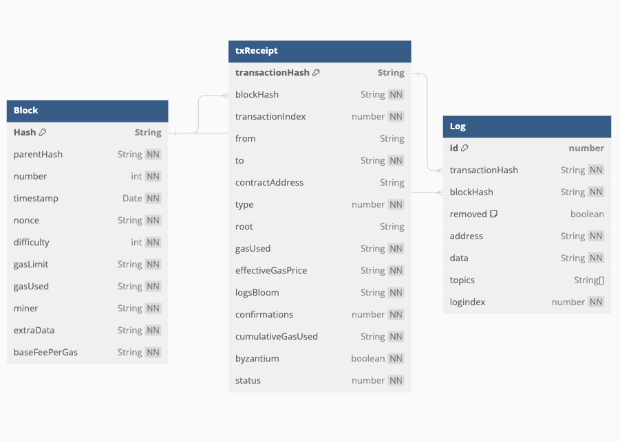
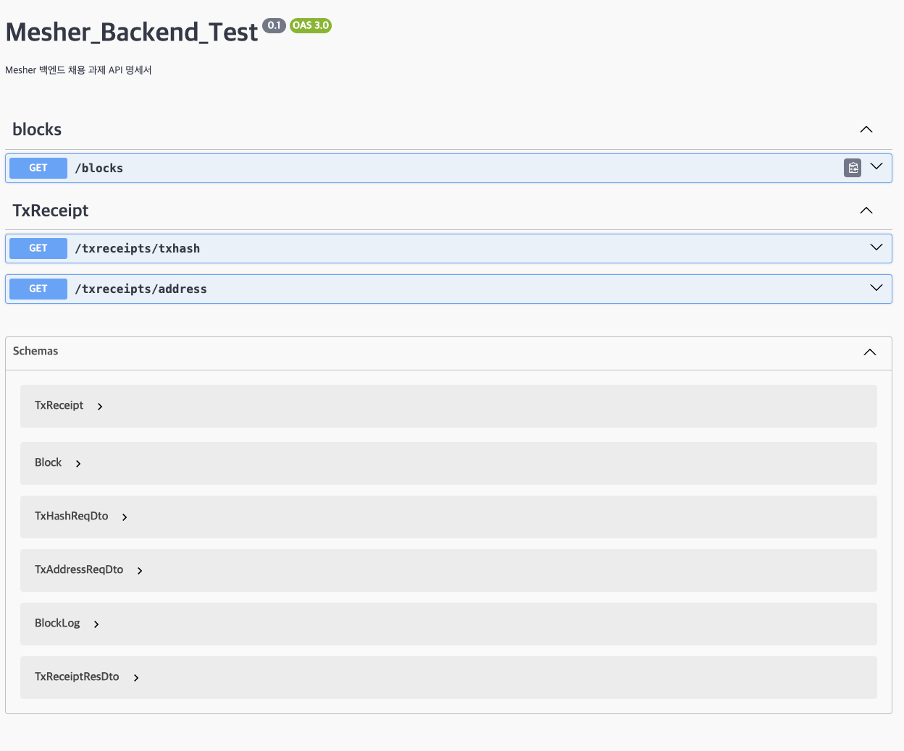

## Mesher 과제 진행

### 사용 기술 스택

Nest.js, Typescript, Ethers.js, Docker, postgreSQL, TypeORM, slackWebHook

### ERD

ERD 주소 : https://dbdiagram.io/d/mesher_test-659e9f72ac844320aea2c986

### API 명세서

서버 동작 후 localhost:3000/docs를 통해 확인할 수 있습니다.

### 회고록

### 구현 계획

#### 1월 10일 구현 계획

1. Ethers.js 사용방법 숙달 (예상 시간 미정) (완료)
2. Ethers.js Network 연결 및 블록체인 데이터 수집 자동화 (완료)

- 최신 Block과 해당 블록의 TransactionReceipt, Log를 계속해서 업로드 하는 것이 목표
- 최적의 방법을 통해 비용 최소화 진행 (조회 호출 최소화 진행)

3. ERD 설계 및 API 구현

#### 1월 11일 구현 계획

4. API 구현 진행

- Controller 및 비즈니스 로직 생성
- Swagger를 통한 API 명세서 작성

5. HealthCheck 슬랙 봇 생성
6. Dockerizing 진행
7. 서버 동작 Test 진행 (완료)

#### 1월 12일 구현 계획

8. 마지막 Server test 진행

- 서버 test 시 ethers Error 발생 (수요일 Test시에는 정상이였으나, 금요일 발생)
- Request-Rate Exceeded 에러
- Promise.all을 통한 병렬처리때문에 발생으로 추정 Or 해당 API Key로 접속 요청이 많아짐에 따라 에러 발생으로 추정
- 추후 Refactoring 예정

9. 관련 문서 제작 및 ReadMe 정리
